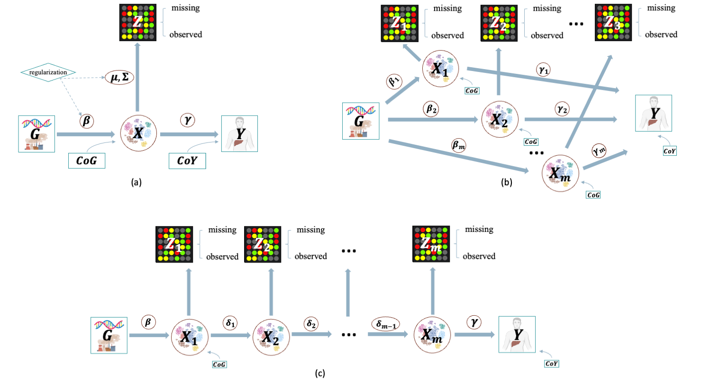
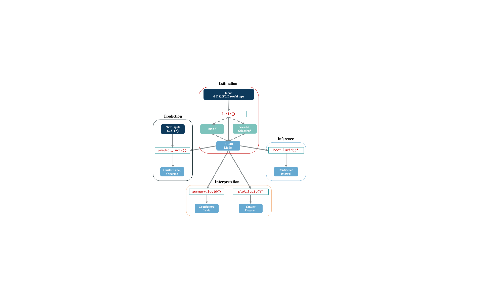

# LUCIDus 3.1.2: LUCID with Multiple Omics Data (The CRAN Version is 3.0.1)

<!-- badges: start -->
[](https://cran.r-project.org/package=LUCIDus)

[](https://image.usc.edu)
<!-- badges: end -->


The **LUCIDus** package implements the statistical method LUCID proposed in the research paper [A Latent Unknown Clustering Integrating
Multi-Omics Data (LUCID) with Phenotypic Traits](https://doi.org/10.1093/bioinformatics/btz667)
(*Bioinformatics*, 2020). LUCID conducts integrated clustering by using multi-view data, including exposures, and omics data with/without outcome. **LUCIDus** features variable selection, incorporating missingness in omics data, visualization of the LUCID model via Sankey diagram, bootstrap inference, and functions for tuning model parameters.

LUCID version 3.0.1, a major update and enhancement from the original release, implements different integration strategies for multi-omics data with multiple layers including LUCID early integration, LUCID in parallel, and LUCID in serial. It also incorporates methods to deal with missingness in multi-omics data. The following DAG illustrates the three different LUCID models for three integration strategies.



If you are interested in the integration of omic data to estimate mediator or latent structures, please check out [Conti
Lab](https://contilab.usc.edu/about/) to learn more.


## Installation

You can install the development version of LUCIDus 3.0.1 from R CRAN with:

``` r
install.packages("LUCIDus")
```


## Workflow
The following figure illustrates the workflow of LUCIDus 3.0.1.



## Usage

Please refer to the
[R manual](https://USCbiostats.github.io/LUCIDus/articles/LUCIDus.html).

## Citation

    #> 
    #> To cite LUCID methods, please use:
    #> 
    #>   Cheng Peng, Jun Wang, Isaac Asante, Stan Louie, Ran Jin, Lida Chatzi,
    #>   Graham Casey, Duncan C Thomas, David V Conti (2019). A latent unknown
    #>   clustering integrating multi-omics data (LUCID) with phenotypic
    #>   traits. Bioinformatics, btz667. URL
    #>   https://doi.org/10.1093/bioinformatics/btz667
    #> 
    #> To cite LUCIDus R package, please use:
    #> 
    #>   Qiran Jia (2023). LUCIDus: LUCID with Multiple Omics Data.
    #>   CRAN. R package version 3.0.1 URL
    #>   https://cran.r-project.org/web/packages/LUCIDus/index.html
    #> 
    #> To see these entries in BibTeX format, use 'print(<citation>,
    #> bibtex=TRUE)', 'toBibtex(.)', or set
    #> 'options(citation.bibtex.max=999)'.


